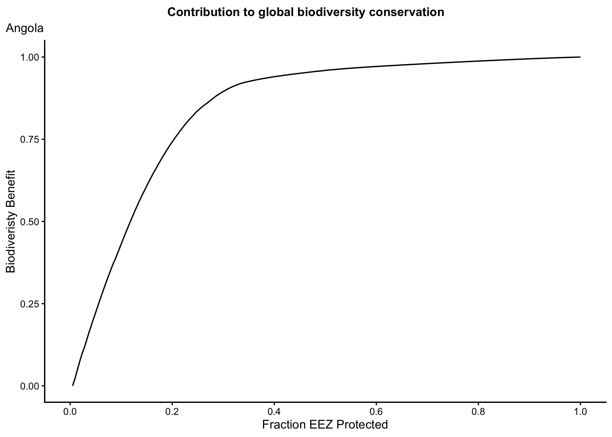
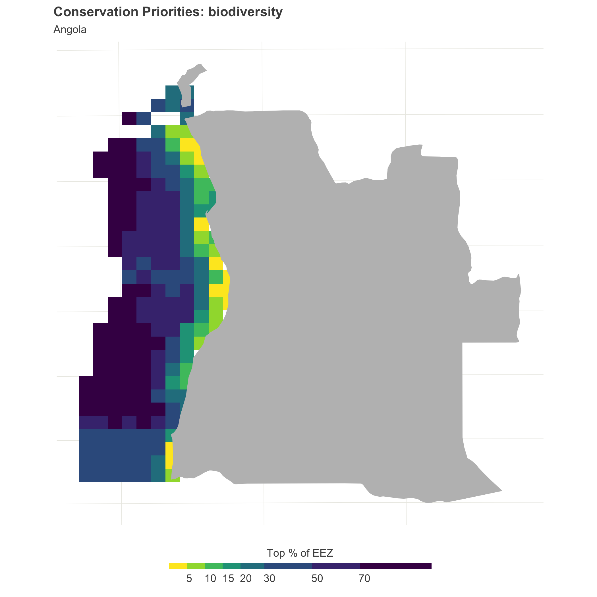
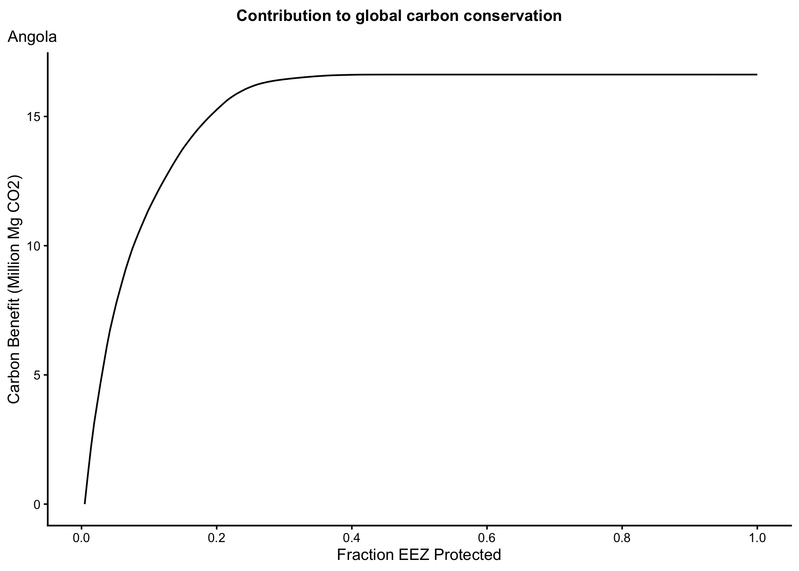
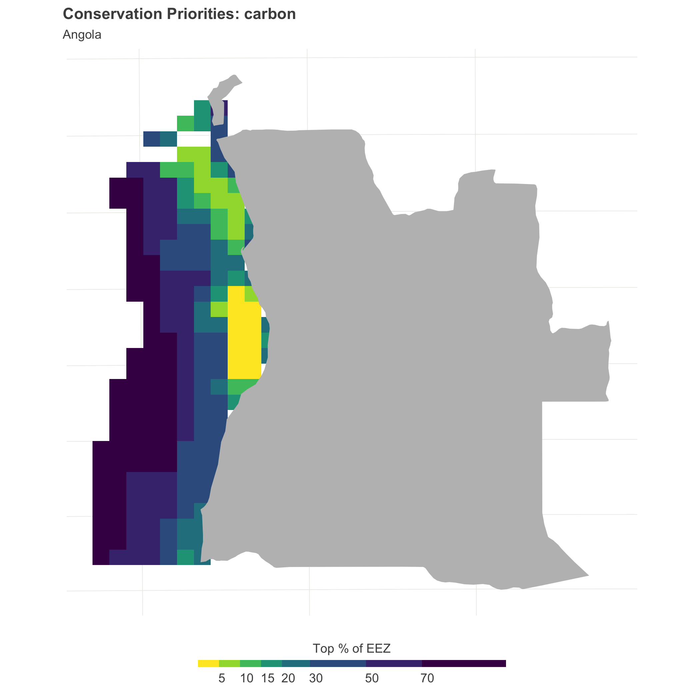
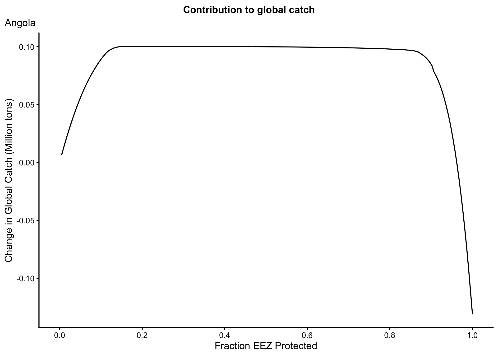
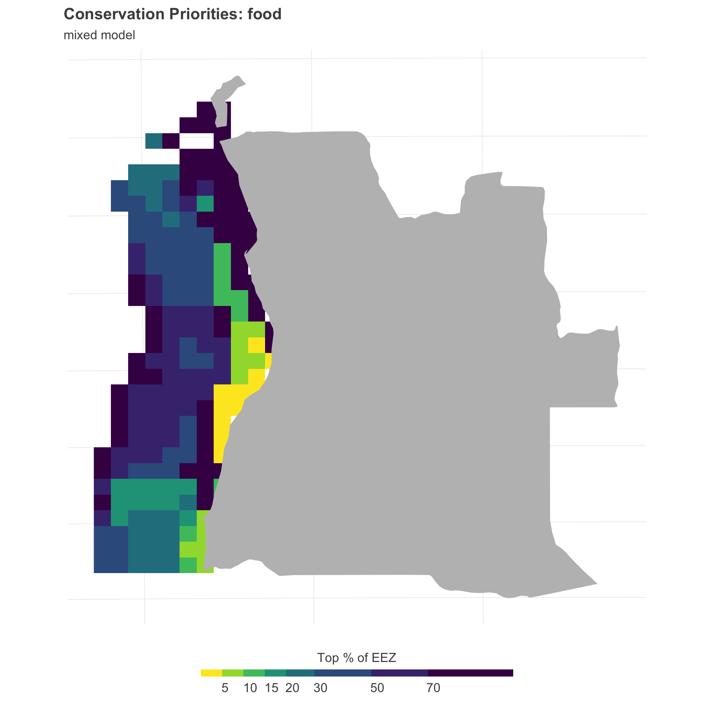
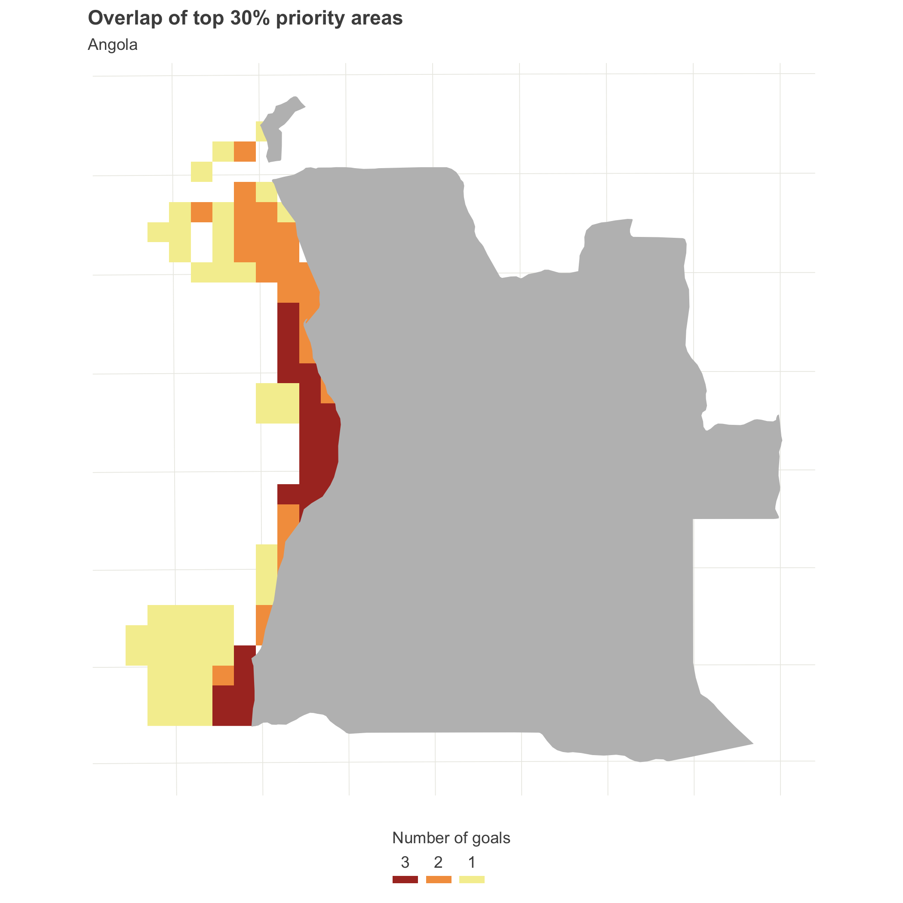
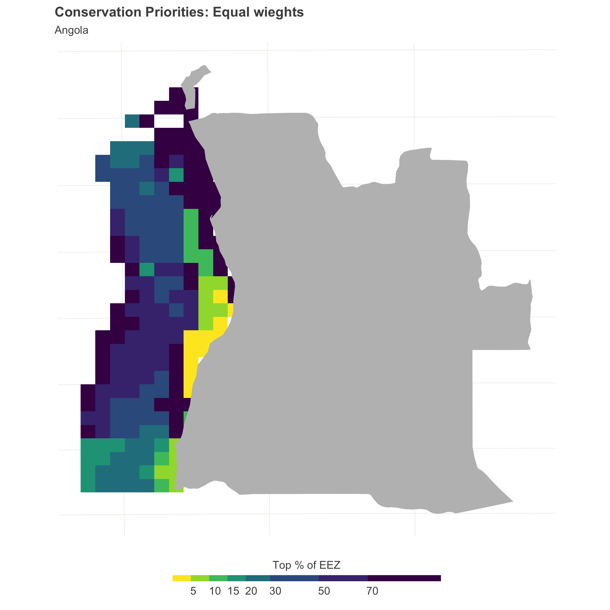
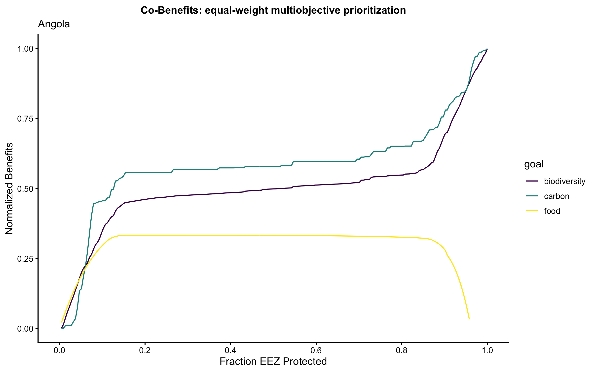

```{r setup, include=FALSE}
knitr::opts_chunk$set(echo = FALSE, fig.width=8, fig.height=4.5, dpi=300, out.width="940px", out.height="529px", fig.align = 'c')

summary_results <- read.csv("summary_results.csv")
equal_wts_summary <- read.csv("optimal_protection_equal_wts.csv")
options(digits=0, scipen = 900)

knitr::knit_hooks$set(inline = function(x) {
  prettyNum(x, big.mark=",")
})

```

## Content

- Biodiversity
- Carbon
- Food provision
- Triple wins
- Equal weights

## Biodiversity

<center>
{#id .class width=60% height=60%}
<center>

## Biodiversity

<center>
{#id .class width=50% height=50%}
<center>

## Biodiversity

 -  The optimal strategy to maximize biodiversity benefits is to protect `r 100*summary_results$optim_protection[summary_results$objective == "biodiversity"]`% of the EEZ. 
 - Protecting the optimal 10% of the EEZ would achieve `r round(100*summary_results$v_at_10_percent[summary_results$objective == "biodiversity"])` % of biodiversity benefits.
  - Protecting the optimal 30% of the EEZ would achieve `r round(100*summary_results$v_at_30_percent[summary_results$objective == "biodiversity"])` % of biodiversity benefits

## Carbon

<center>
{#id .class width=60% height=60%}
<center>

## Carbon

<center>
{#id .class width=50% height=50%}
<center>

## Carbon

 -  The optimal strategy to maximize carbon benefits is to protect `r 100*summary_results$optim_protection[summary_results$objective == "carbon"]`% of the EEZ. This would avoid the release of up to `r round(summary_results$max_v[summary_results$objective == "carbon"])/10^6` million tons of CO2 as a result of bottom trawling. 
 - Protecting the optimal 10% of the EEZ would achieve `r round(100*summary_results$v_at_10_percent[summary_results$objective == "carbon"])` % of carbon benefits.
  - Protecting the optimal 30% of the EEZ would achieve `r round(100*summary_results$v_at_30_percent[summary_results$objective == "carbon"])` % of carbon benefits

## Food

<center>
{#id .class width=60% height=60%}
<center>

## Food 

<center>
{#id .class width=50% height=50%}
<center>

## Food 

 -  The optimal strategy to maximize food provision benefits is to protect `r 100*summary_results$optim_protection[summary_results$objective == "food"]`% of the EEZ. This would yield a net gain in catch of `r round(summary_results$max_v[summary_results$objective == "food"])` tons
 - Protecting the optimal 10% of the EEZ would achieve `r round(100*summary_results$v_at_10_percent[summary_results$objective == "food"])` % of food benefits.
  - Protecting the optimal 30% of the EEZ would achieve `r round(100*summary_results$v_at_30_percent[summary_results$objective == "food"])` % of food benefits

## Triple wins

<center>
{#id .class width=50% height=50%}
<center>

## Equal weights

<center>
{#id .class width=50% height=50%}
<center>

## Equal weights

<center>
{#id .class width=60% height=60%}
<center>

## Equal weights

  - The optimal strategy to simultaneously maximize all objectives call for protection of `r round(100*equal_wts_summary$fraction_protected[1])` % of the EEZ. 
  - This would achieve `r round(100*equal_wts_summary$v[equal_wts_summary$goal == "carbon"])` %, `r round(100*equal_wts_summary$v[equal_wts_summary$goal == "biodiversity"])` %, `r round(100*equal_wts_summary$v[equal_wts_summary$goal == "food"])` %, of the carbon, biodiversity, and food provision benefits, respectively. 

